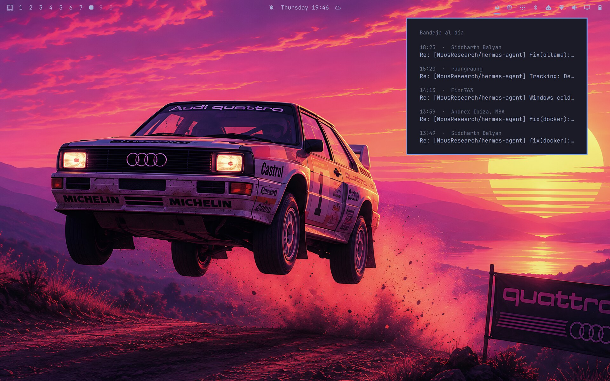

# Omarchy Proton Mail Notifier

[English](README.md) | [Español](README.es.md) | **Français** | [Deutsch](README.de.md) | [Italiano](README.it.md) | [中文](README.zh.md)

Un plugin du shell [Omarchy](https://omarchy.org) qui affiche votre **nombre
de mails Proton Mail non lus dans la barre** (en haut à droite, à côté de la
zone de notification), déroule la liste de vos **messages les plus récents**
au clic, et déclenche une notification de bureau à l'arrivée d'un nouveau
mail.

Sans extension de navigateur, sans Proton Mail Bridge — fonctionne avec les
**comptes Proton gratuits et payants** et tout navigateur basé sur Chromium
(Brave, Chrome, Chromium, Edge).

Le widget parle **English, Español, Français, Deutsch, Italiano et 中文**
(English par défaut), et tout est configurable à chaud via `omarchy bar set`
— intervalle d'interrogation, taille du menu déroulant, surnom de l'en-tête,
notifications, langue.

## Captures d'écran




## Fonctionnement

```
Webapp Proton Mail (profil de navigateur dédié, fenêtre --app)
titre : « (3) Inbox | … | Proton Mail »
        │
        ├─ hyprctl clients -j ──► omarchy-protonmail-unread ──► badge 󰇮 N + notification
        │   (titres de fenêtres)     (toutes les intervalSec)
        │
        └─ CDP (127.0.0.1:9229) ──► omarchy-protonmail-recent ──► menu déroulant avec les N derniers messages
            (protocole DevTools)        (à l'ouverture / changement du compteur)
```

- **Nombre de non lus** : Proton Mail le met dans le titre de la page sous la
  forme `(N)`, et Hyprland expose les titres de fenêtres via `hyprctl clients
  -j`. Fonctionne avec la fenêtre de la webapp *et* avec tout onglet classique
  du navigateur affichant Proton Mail.
- **Messages récents** : la webapp installée tourne dans un profil de
  navigateur dédié avec un port DevTools local (`127.0.0.1:9229`). Le plugin
  lit les lignes de la boîte de réception directement dans la page via CDP —
  Python avec la seule bibliothèque standard, rien d'autre à installer.

## Installation

```bash
git clone https://github.com/686f6c61/Omarchy-Proton-Mail.git
cd Omarchy-Proton-Mail
./install.sh
```

L'installateur :

1. Télécharge l'icône Proton et crée le lanceur de la **webapp « Proton Mail »**
   (`omarchy webapp install`) avec un profil dédié + port CDP.
2. Installe `omarchy-protonmail-unread` et `omarchy-protonmail-recent` dans
   `~/.local/share/omarchy-protonmail/`.
3. Installe le plugin du shell dans
   `~/.config/omarchy/plugins/686f6c61.proton-mail/`.
4. Active le widget dans la **section droite** de la barre (avec sauvegarde
   préalable de `~/.config/omarchy/shell.json`) et redémarre le shell.
5. Demande votre **langue** et un **surnom** facultatif (interactif).
   Alternative non interactive : `./install.sh --language es --nickname "My mail"`

Lancez ensuite **Proton Mail** depuis le menu des applications (SUPER + ESPACE)
et connectez-vous. Le profil dédié signifie que vous vous connectez une seule
fois, indépendamment de votre navigateur principal.

## Utilisation

- **Clic gauche sur le widget** : menu déroulant avec les N derniers messages
  (expéditeur, objet, heure ; les non lus en gras). Cliquez sur un message
  pour basculer vers la fenêtre Proton Mail — la fenêtre existante reçoit le
  focus, jamais de doublon.
- Avec `recentCount: "0"`, le menu déroulant est désactivé et le clic gauche
  se contente de mettre le focus sur la fenêtre Proton Mail (mode notificateur
  pur).
- **Clic droit/central** : actualiser maintenant.
- Un clic sur la notification ouvre/active aussi Proton Mail.

États du widget (toujours visible tant qu'il est activé) :

| État                 | Signification                        |
|----------------------|--------------------------------------|
| 󰇯 estompé            | Fenêtre Proton Mail non ouverte      |
| 󰇯 normal             | Ouvert, aucun mail non lu            |
| 󰇮 N (accent)         | N non lus — notification déclenchée  |
| 󰇮 99+ (accent)       | Plus de 99 non lus                   |

## Paramètres

La méthode la plus rapide est la commande `omarchy bar set` (appliquée à
chaud, sans redémarrage) :

```bash
omarchy bar set 686f6c61.proton-mail recentCount 7
omarchy bar set 686f6c61.proton-mail nickname "Mes mails"
omarchy bar set 686f6c61.proton-mail language fr
omarchy bar set 686f6c61.proton-mail intervalSec 10
omarchy bar set 686f6c61.proton-mail notify false
```

Vous pouvez aussi modifier l'entrée du widget directement dans
`~/.config/omarchy/shell.json` :

```json
{ "id": "686f6c61.proton-mail", "intervalSec": 5, "recentCount": "5", "notify": true, "nickname": "", "language": "en" }
```

- `intervalSec` (2–60, 5 par défaut) : intervalle d'interrogation du nombre
  de non lus.
- `recentCount` (0–20, 5 par défaut) : messages listés dans le menu
  déroulant. `0` désactive le menu déroulant (notificateur seul).
- `notify` (true par défaut) : notification de bureau quand le compteur
  augmente.
- `nickname` (vide par défaut) : texte personnalisé pour l'en-tête du menu
  déroulant quand il n'y a aucun mail non lu. Vide affiche le texte par défaut
  de la langue choisie (« Boîte à jour » en français).
- `language` (`en`/`es`/`fr`/`de`/`it`/`zh`, `en` par défaut) : langue du
  widget, du menu déroulant et des notifications (English, Español, Français,
  Deutsch, Italiano, 中文).

## Dépannage

- **Le widget n'apparaît pas après l'installation** : exécutez `omarchy
  restart shell` (le chargeur QML met en cache les échecs associés aux URL
  des plugins ; un shell neuf les efface).
- **Le widget ne prend pas en compte les modifications QML pendant le
  développement** : même cause — le rechargement à chaud par inotify peut
  continuer à servir du bytecode en cache pour l'URL du plugin. Exécutez
  `omarchy restart shell` après avoir modifié les fichiers du plugin.
- **Le menu déroulant affiche la ligne de connexion** : connectez-vous dans la
  fenêtre de la webapp « Proton Mail » (le profil dédié a sa propre session).
- **Menu déroulant vide alors que vous êtes connecté** : l'extraction devra
  peut-être être réajustée à votre version de Proton — exécutez
  `~/.local/share/omarchy-protonmail/omarchy-protonmail-recent --dump` et
  ouvrez un ticket avec la sortie.
- Le badge des non lus dépend du format `(N)` du titre de page de Proton
  Mail ; la logique de correspondance se trouve dans
  `bin/omarchy-protonmail-unread`.

## Désinstallation

```bash
omarchy webapp remove "Proton Mail"
rm -rf ~/.config/omarchy/plugins/686f6c61.proton-mail ~/.local/share/omarchy-protonmail
# supprimez ensuite l'entrée { "id": "686f6c61.proton-mail" } de ~/.config/omarchy/shell.json
# (ou restaurez la sauvegarde shell.json.bak.<timestamp> créée par install.sh)
omarchy restart shell
```

## Licence

[MIT](LICENSE) © 686f6c61 <github@00b.tech>
